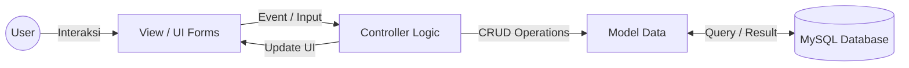
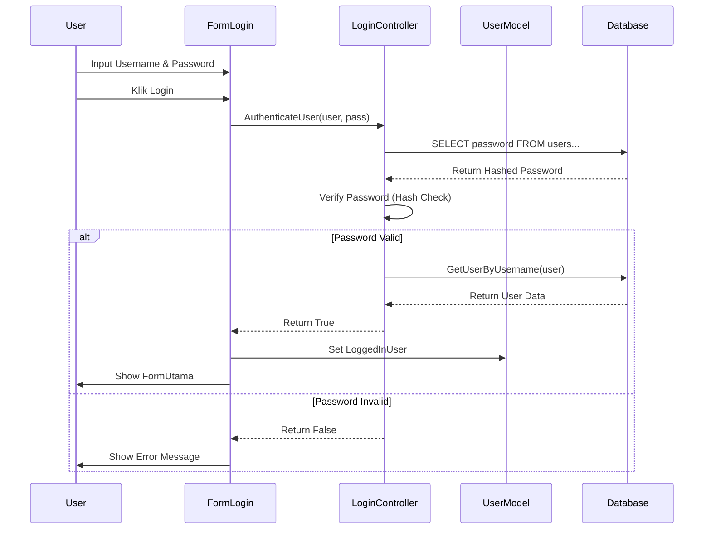
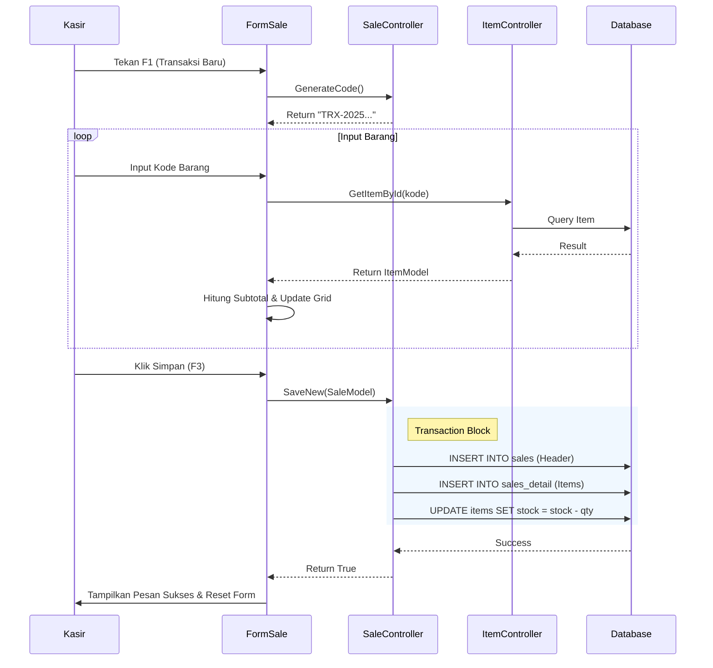
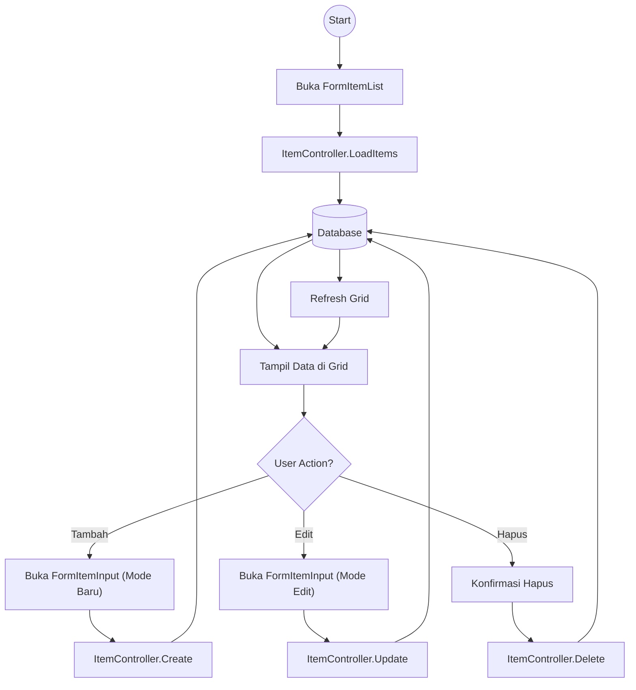
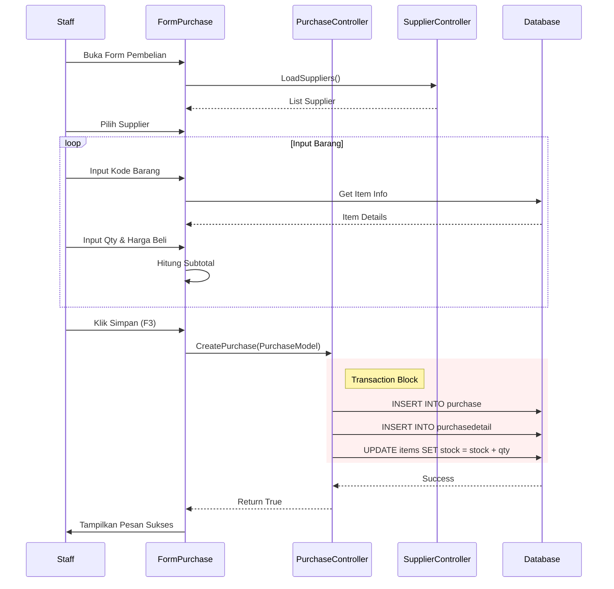
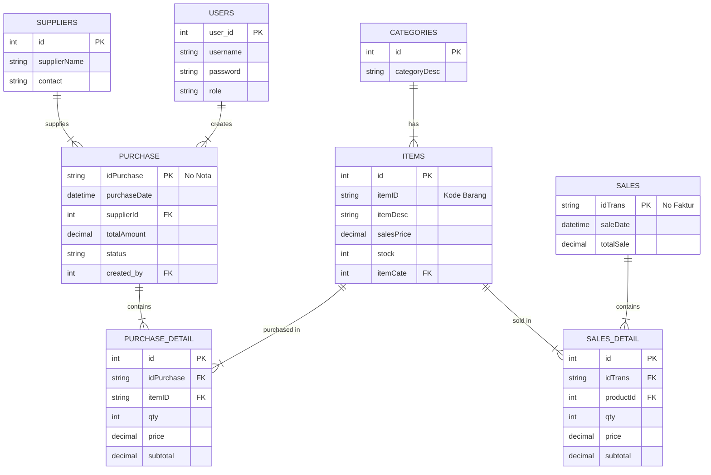
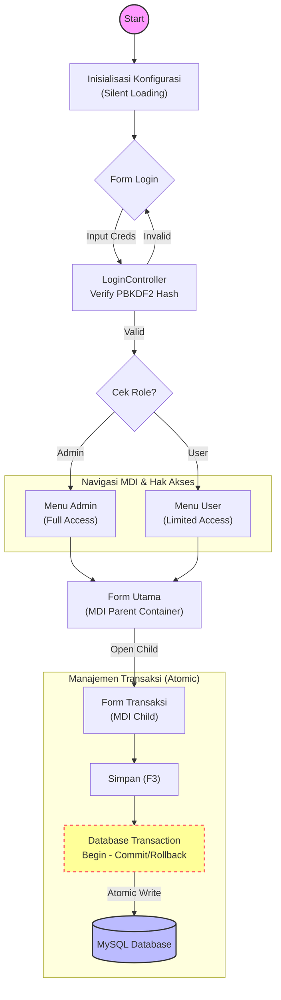
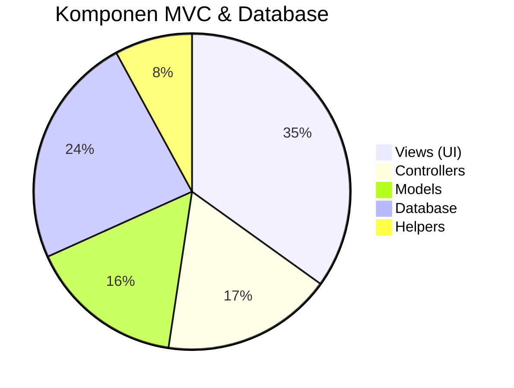

# Visualisasi Arsitektur Aplikasi (MVC)

Dokumen ini memvisualisasikan struktur dan alur kerja aplikasi penjualan berbasis Desktop (VB.NET) yang telah dibangun. Visualisasi ini menggunakan diagram untuk menjelaskan bagaimana komponen Model, View, dan Controller saling berinteraksi.

---

## 1. Konsep Dasar MVC (Model-View-Controller)

Diagram ini menggambarkan aliran data umum dalam aplikasi ini.



*   **View**: Menangani tampilan (Form) dan input user.
*   **Controller**: Menangani logika bisnis, validasi, dan komunikasi database.
*   **Model**: Merepresentasikan struktur data (Object).

---

## 2. Struktur Folder Proyek

Visualisasi struktur file dalam Solution Explorer yang mencerminkan pemisahan concern (tanggung jawab).

```
WinFormsApp_Latihan/
├── 🎮 Controllers/          (Otak Aplikasi)
│   ├── LoginController.vb
│   ├── ItemController.vb
│   ├── SaleController.vb
│   ├── PurchaseController.vb
│   ├── SupplierController.vb
│   ├── UserController.vb
│   └── ...
│
├── 📦 Models/               (Struktur Data)
│   ├── UserModel.vb
│   ├── ItemModel.vb
│   ├── SaleModel.vb
│   ├── PurchaseModel.vb
│   ├── SupplierModel.vb
│   ├── ConfigModel.vb
│   └── ...
│
├── 🖥️ Views/                (Tampilan / GUI)
│   ├── 📂 Main/             (Form Utama, Login, Setting)
│   ├── 📂 Items/            (Master Barang)
│   ├── 📂 Category/         (Master Kategori)
│   ├── 📂 Supplier/         (Master Supplier)
│   ├── 📂 User/             (Kelola User)
│   ├── 📂 Sale/             (Transaksi Penjualan)
│   ├── 📂 Purchase/         (Transaksi Pembelian)
│   ├── 📂 Report/           (Laporan)
│   └── ...
│
└── 🛠️ Helpers/              (Fungsi Pendukung)
    ├── PrintHelper.vb
    └── CustomMessageDialog.vb
```

---

## 3. Diagram Alur Modul (Sequence Diagrams)

Berikut adalah visualisasi detail bagaimana kode bekerja di belakang layar untuk fitur-fitur utama.

### A. Alur Login (Authentication)



### B. Alur Transaksi Penjualan (Sales Transaction)



### C. Alur Master Data (CRUD Barang)



### D. Alur Transaksi Pembelian (Purchase Transaction)



---

## 4. Skema Database (Entity Relationship)

Visualisasi relasi antar tabel yang digunakan dalam aplikasi (berdasarkan analisis Model).



---

## 5. Kesimpulan Arsitektur

Aplikasi ini menggunakan **Layered Architecture** yang ketat:

1.  **Presentation Layer (Views)**: Tidak boleh ada query SQL di sini. Hanya logika tampilan.
2.  **Business Logic Layer (Controllers)**: Pusat logika. Mengatur transaksi dan validasi data.
3.  **Data Access Layer (Integrated in Controllers/Models)**: Menggunakan ADO.NET (MySqlClient) untuk akses data langsung.
4.  **Cross-Cutting Concerns**: Helper classes untuk fungsi umum seperti pencetakan dan pesan dialog.

---

## 6. Alur Kerja Aplikasi (Application Flow)

Visualisasi alur kerja sistem yang mengedepankan keamanan dan kenyamanan pengguna, mulai dari inisialisasi hingga manajemen transaksi atomik.



---

## 7. Metrik Pengembangan & Pengujian

Visualisasi statistik pengembangan dan cakupan pengujian untuk memvalidasi keberhasilan sistem.

### A. Distribusi Komponen Kode



### B. Checklist Validasi Sistem

```mermaid
mindmap
  root((Pengujian<br/>Sistem))
    Keamanan
      (PBKDF2 Hashing)
      (Role Based Access)
      (SQL Injection Prevent)
      (Hidden Settings)
    Fungsionalitas Utama
      [Login Module]
      [Master Data Items]
      [Master Supplier]
      [Kelola User]
    Transaksi
      (Penjualan - Multi Item)
      (Pembelian - Stok Update)
      (Atomic Save)
    Laporan
      [Laporan Penjualan]
      [Laporan Pembelian]
      [Export PDF/CSV]
